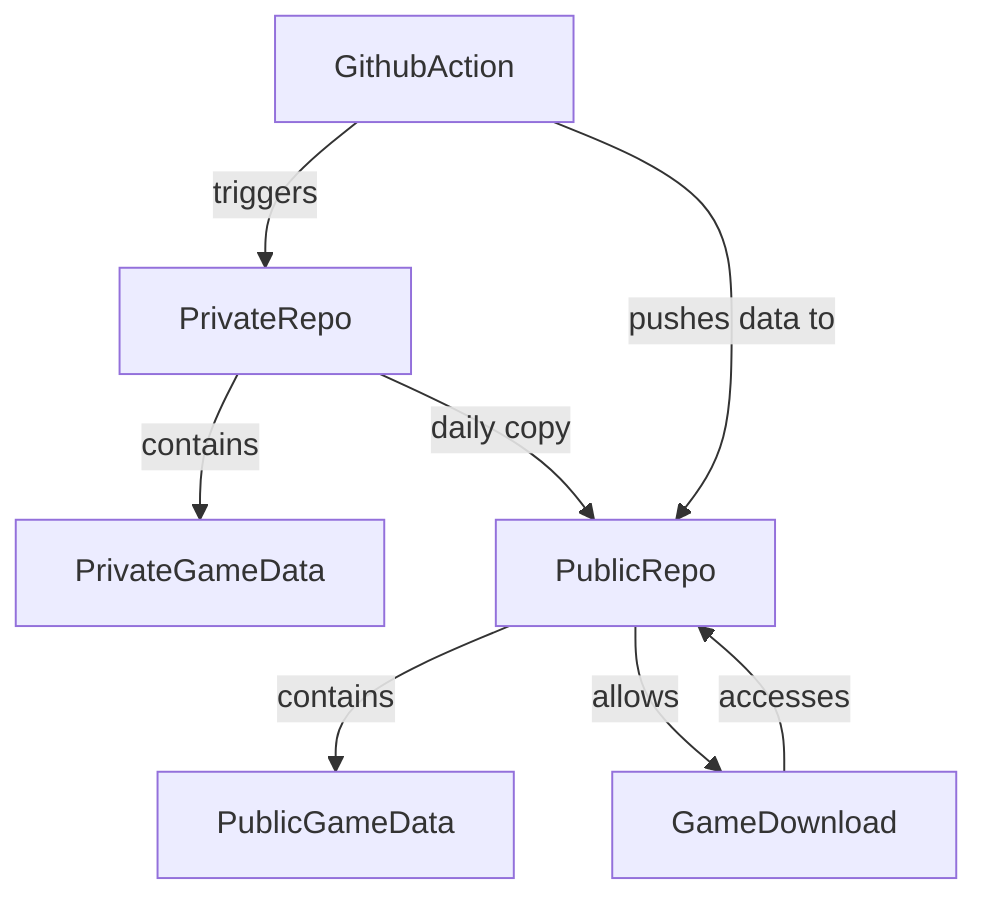

# Fluttercode
Project

prompt
```
use mermaid to draw a diagram for below,
a public github repository holds public game data
a private github repository holds private game data
a github action execute daily, which copy game date from private repository to public repository
a game download public game data from public repository
```
